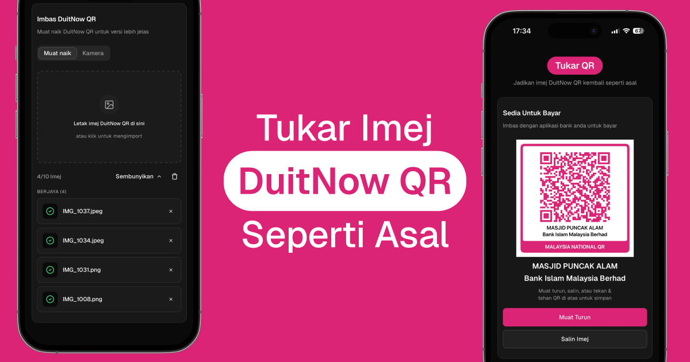

# Tukar QR



Convert blurry DuitNow QR photos into clean, scannable codes—upload, camera, or paste. All processing stays in the browser.

**Live:** [tukarqr.my](https://tukarqr.my)

## Features

- **Input** – Upload, camera, drag-and-drop, clipboard paste (Ctrl+V / ⌘V), HEIC/HEIF from iOS
- **Batch** – Up to 10 images, concurrent decode, ZIP download of all results
- **DuitNow** – Validates Malaysia EMVCo payment QR; optional bank name on the generated code
- **Look & export** – Malaysia National QR frame, square or rounded modules, PNG copy/download (1:1 or 3:4, white or transparent background)
- **UX** – Responsive dialog/drawer, lightbox preview, onboarding + privacy modal, cross-browser clipboard

## Stack

Next.js (App Router), React, TypeScript, Tailwind CSS 4, shadcn/ui + Radix, Framer Motion. QR: jsQR, ZXing, `qrcode`; HEIC: heic2any; ZIP: JSZip. Toasts (Sonner), drawers (Vaul). Tests: Vitest.

## Quick start

Requires **Node.js 18+** (20 recommended).

```bash
npm install
npm run dev          # http://localhost:3000
npm run build && npm start
npm test
```

## Deploy (Cloudflare Pages)

Static export on **Cloudflare Pages** (not Vercel).

1. **Workers & Pages** → Create → Pages → connect Git (framework preset: **None**).
2. Build: `npm run build` · Output: `out` · Env: `NEXT_PUBLIC_SITE_URL=https://your-domain.com`
3. Optional: **Custom domains** in the Pages project. Rules live in [`public/_redirects`](public/_redirects) and [`public/_headers`](public/_headers).

## Privacy

Nothing is uploaded to a server—QR work runs in your tab only.

## Forking this repo

Scan for secrets before pushing; keep `.env*` out of git ([.gitignore](.gitignore)). Enable GitHub secret scanning / Dependabot if you can. Reports: [SECURITY.md](SECURITY.md).

## License

[MIT](LICENSE)
