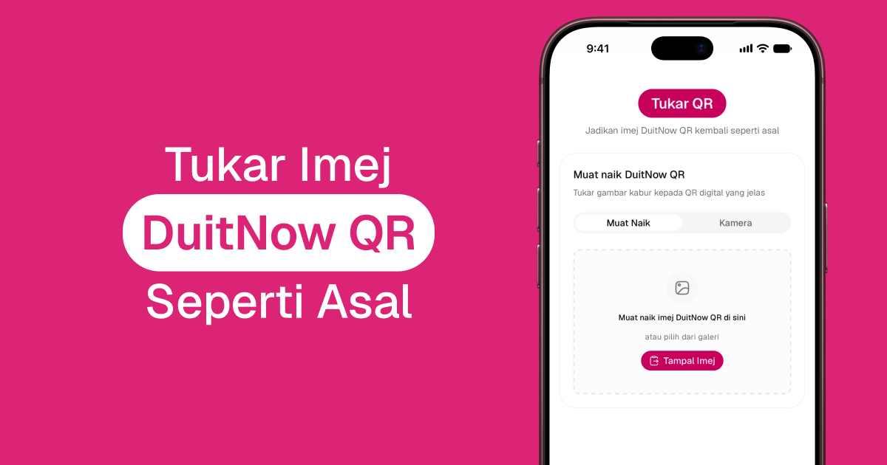

# Tukar QR

<p align="center">
  <a href="https://tukarqr.my">
    
  </a>
</p>

Convert blurry DuitNow QR photos into clean, scannable codes—upload, camera, or paste. All processing stays in the browser.

**Live:** [tukarqr.my](https://tukarqr.my)

## Contributing

See [CONTRIBUTING.md](CONTRIBUTING.md). Please follow our [Code of Conduct](CODE_OF_CONDUCT.md).

## Features

- **Input** – Upload, camera, drag-and-drop, clipboard paste (Ctrl+V / ⌘V), HEIC/HEIF from iOS
- **Batch** – Up to 10 images, concurrent decode, ZIP download of all results
- **DuitNow** – Validates Malaysia EMVCo payment QR; optional bank name on the generated code
- **Look & export** – Malaysia National QR frame, square or rounded modules, PNG copy/download (1:1 or 3:4, white or transparent background)
- **UX** – Responsive dialog/drawer, lightbox preview, onboarding + privacy modal, cross-browser clipboard

## Stack

Next.js (App Router), React, TypeScript, Tailwind CSS 4, shadcn/ui, Framer Motion. QR: jsQR, ZXing, `qrcode`; HEIC: heic2any; ZIP: JSZip.

## Privacy

Nothing is uploaded to a server—QR work runs in your tab only.

## MCP

Remote MCP for DuitNow QR **validate**, **parse**, and **encode**. Hosted as a Cloudflare Worker at [https://mcp.tukarqr.my/mcp](https://mcp.tukarqr.my/mcp). The website stays on Pages; this Worker is a separate project (`tukarqr-mcp`).

Text-only: send EMVCo payload strings. Do not send images. Payloads are not stored.

| Tool | Input | Output |
|------|-------|--------|
| `get_validate_duitnow_qr` | `payload` | `{ valid, reasonCode?, reason? }` |
| `get_parse_duitnow_qr` | `payload` | merchant, bank, amount, country |
| `get_encode_qr` | `payload`, optional `format` (`png` \| `svg`), `size` | PNG base64 or SVG |

Cursor (`~/.cursor/mcp.json` or `.cursor/mcp.json`):

```json
{
  "mcpServers": {
    "tukarqr": {
      "url": "https://mcp.tukarqr.my/mcp"
    }
  }
}
```

Claude Desktop: add the endpoint URL under Settings → Connectors → Add custom connector.

Local development and deploy notes: [mcp/README.md](mcp/README.md).

## License

[MIT](LICENSE)
